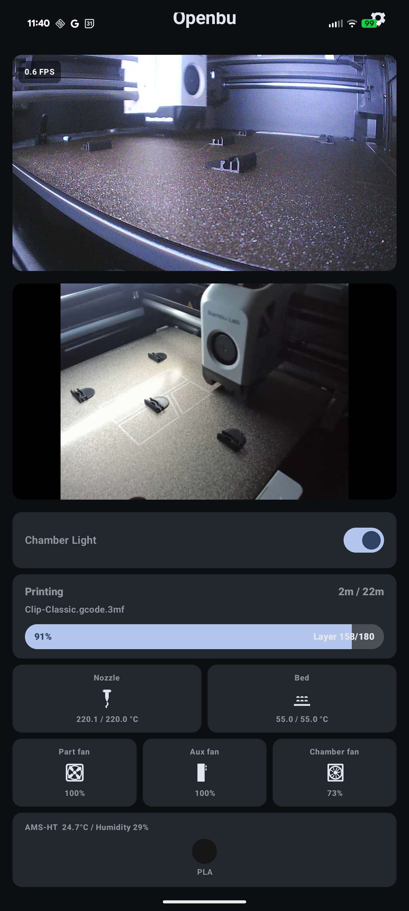

# Openbu

  <a href="https://discord.gg/vDuSpJEDrW">
    <picture>
      <source height="24px" media="(prefers-color-scheme: dark)" srcset="/assets/icons/Discord.png" />
      
    </picture>
  </a>

Openbu is a open source [Kotlin](https://en.wikipedia.org/wiki/Kotlin) based [Android](https://en.wikipedia.org/wiki/Android_(operating_system)) app written for [Bambu Lab](https://bambulab.com/en-us) printers in [Developer Mode](https://help.simplyprint.io/en/article/bambu-lab-lan-only-mode-and-developer-mode-how-to-enable-xa0hch/).

## Backstory(aka Why not Handy or Lanbu?)
I own a [Bambu Lab](https://bambulab.com/en-us) [P1S](https://bambulab.com/en-us/p1). I would have stuck with the older pre-1.08 firmware, but then I purchased a [AMS HT](https://us.store.bambulab.com/products/ams-ht?from=home_web_top_navigation) which needed 1.08+ firmware to be properly supported. I also wanted [OrcaSlicer](https://github.com/OrcaSlicer/OrcaSlicer) support under [Linux](https://en.wikipedia.org/wiki/Linux), and there is no [Bambu Connect](https://wiki.bambulab.com/en/software/bambu-connect) for [Linux](https://en.wikipedia.org/wiki/Linux). It has been "Under Development" for about a year.

I quickly found [Lanbu](https://play.google.com/store/apps/details?id=com.Glowbeast.LanBu&hl=en_US), but I have a few issues with it. It isn't open source, it isn't especially pretty, the author locked the video feature behind a paywall, and it doesn't auto-detect the printers on the network.

## Status
This is a brand new project, and has stated above I own a [P1S](https://bambulab.com/en-us/p1) and a [AMS HT](https://us.store.bambulab.com/products/ams-ht?from=home_web_top_navigation). This makes it harder to test and support A1, P2, X1, and H2 series printers. It also makes it harder to test and support the [AMS](https://us.store.bambulab.com/products/ams-multicolor-printing?from=home_web_top_navigation) and [AMS 2 Pro](https://us.store.bambulab.com/products/ams-2-pro?from=home_web_top_navigation).

I am currently trying to workaround this with a program that mocks the [MQTT](https://en.wikipedia.org/wiki/MQTT) output. My plan is to open source that too as another git repository.

This means user testing of every possible configuration would be very helpful, and then open [issues](https://github.com/cygnusx-1-org/openbu/issues).

I have currently tested this on a [Google Pixel 8 Pro](https://www.gsmarena.com/google_pixel_8_pro-12545.php) running [Android 16](https://en.wikipedia.org/wiki/Android_16). The current minimum [Android](https://en.wikipedia.org/wiki/Android_(operating_system)) version is [8/Oreo](https://en.wikipedia.org/wiki/Android_Oreo).

I am strongly considering adding this to the [Google Play Store](https://play.google.com/store/apps?hl=en_US), but we will see. They sometimes make that a challenge. I already have one app in the store.

## Features
* Auto-detects printers, and auto fills in the ip address and serial number. Hence only requires the access code.
* Allows the user to add an external [RTSP](https://en.wikipedia.org/wiki/Real-Time_Streaming_Protocol) stream to the dashboard by entering a [RTSP](https://en.wikipedia.org/wiki/Real-Time_Streaming_Protocol) URL
* Supports the A1/P1 series video stream based on JPEGs
* Supports toggling the chamber light for the P1 series
* [AMS HT](https://us.store.bambulab.com/products/ams-ht?from=home_web_top_navigation), [AMS](https://us.store.bambulab.com/products/ams-multicolor-printing?from=home_web_top_navigation), and [AMS 2 Pro](https://us.store.bambulab.com/products/ams-2-pro?from=home_web_top_navigation)
  - Knows the correct number of trays per model
  - Shows temperature, humidity, filament types, and filament colors
* Shows job status including layers, time left, estimated time, job name, and percentage of job done
* Shows status of the nozzle, bed, part fan, aux fan, and chamber fan

## Screenshots

[All screenshots](https://github.com/cygnusx-1-org/openbu/tree/master/screenshots)

## TODO
* Better support multiple printers
* Support multiple internal cameras
* Support [RTSP](https://en.wikipedia.org/wiki/Real-Time_Streaming_Protocol) streams from non A1/P1 series internal cameras
* Better overall support for non-P1 series printers
* Nozzle controls
* Speed control
* Support build farms with many printers

## Donations

Any monetary donation would be appreciated. I am open to hardware donations.
